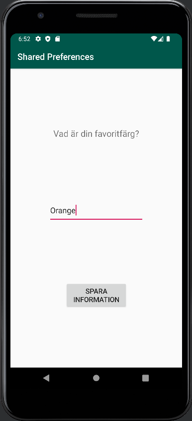
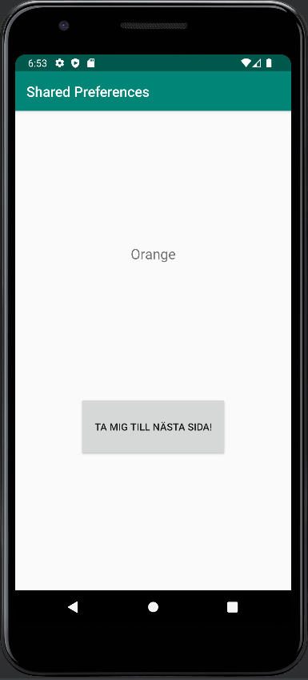

# Rapport

A second activity was created by adding a new activity file (SecondActivity.java) in the 
java folder. This activity was also added as an element in the AndroidManifest.xml file with
attributes such as parentActivityName and name. Code for this element can be seen below. 

AndroidManifest.xml
```
        <activity
            android:name=".MainActivity"
            android:label="@string/app_name"
            android:theme="@style/AppTheme.NoActionBar">
            . . .
        </activity>
```

Inside MainActivity's layout file (activity_main.xml), a TextView and a button is implemented. 
The TextView is implemented to later display shared preferences data, for now it is filled with 
default text. The ButtonView is implemented to eventually take the user from MainActivity to SecondActivity. 
The code for both views can be seen below.

activity_main.xml
```
    <TextView
        android:id="@+id/preftextview"
        android:layout_width="wrap_content"
        android:layout_height="wrap_content"
        android:text="@string/hejsan"
        android:textSize="20sp" . . . />

    <Button
        android:id="@+id/button"
        android:layout_width="210dp"
        android:layout_height="86dp"
        android:text="@string/buttonMain" . . . />
```

The same ButtonView is referenced inside MainActivity to create an object. This object then gets an 
OnClick() method that creates an intent to send the user from MainActivity to SecondActivity. With 
this code, the button successfully takes the user from one activity to another. The code for this 
can be seen below.

MainActivity.java
```
    @Override
    protected void onCreate(Bundle savedInstanceState) {
        . . .
        Button button1 = findViewById(R.id.button);
        button1.setOnClickListener(new View.OnClickListener() {
            @Override
            public void onClick(View view) {
                Intent intent = new Intent(MainActivity.this, SecondActivity.class);
                startActivity(intent);
            }
        });
    }
```

Inside the layout file for SecondActivity (activity_second.xml), an EditText, TextView, and button 
are created. The TextView prompts the user to write something inside the EditTextView, this input is
then supposed to be saved with shared preferences upon clicking the button. The activity also gets a
toolbar like MainActivity for the sake of consistency. The views can be seen below. 

activity_second.xml
```
    <com.google.android.material.appbar.AppBarLayout
        . . .
        <androidx.appcompat.widget.Toolbar
            android:id="@+id/toolbar2"  . . . />
    </com.google.android.material.appbar.AppBarLayout>
    
    <Button
        android:id="@+id/button2"
        android:layout_width="143dp"
        android:layout_height="62dp"
        android:text="@string/skicka"
        android:textSize="16sp"  . . . />

    <TextView
        android:id="@+id/textView2"
        android:layout_width="wrap_content"
        android:layout_height="wrap_content"
        android:text="@string/paragraph"
        android:textSize="20sp"  . . . />

    <EditText
        android:id="@+id/prefEditText"
        android:layout_width="219dp"
        android:layout_height="56dp"
        android:ems="10"
        android:inputType="textPersonName"
        android:text="@string/favoritfarg"  . . . />
```

Similar to MainActivity, SecondActivity also references the button from its own layout file to create 
an OnClickListener. Inside the OnClick() method, an instance of sharedPreferences and 
SharedPreferences.Editor are implemented. Additionally, an object for the EditTextView is created 
and used to get its value and store it as a preference. This change is lastly applied. The code will 
not take the user anywhere, which means the user will have to either restart the app or use the back-button 
in their phone's navigation bar to see any change. Code snippets and a screenshot of SecondActivity 
can be seen below.

```
public class SecondActivity extends AppCompatActivity{
    private SharedPreferences sharedPreferences;
    private SharedPreferences.Editor myPreferenceEditor;
    
    @Override
    protected void onCreate(Bundle savedInstanceState) {
        . . .
        Button button2 = findViewById(R.id.button2);
        button2.setOnClickListener(new View.OnClickListener() {
            @Override
            public void onClick(View view) {
                sharedPreferences = getSharedPreferences("preferences", MODE_PRIVATE);
                myPreferenceEditor = sharedPreferences.edit();
                EditText newPrefText = findViewById(R.id.prefEditText);
                myPreferenceEditor.putString("MyAppPreferenceString", newPrefText.getText().toString());
                myPreferenceEditor.apply();
            }
        });

    }
}
```

SecondActivity


Back in MainActivity, the shared preferences are fetched inside onResume().
An object is also created for the TextView inside the layout file (activity_main.xml).
It is then specified that this object should display the preference value or a default value
in case no preference has been set. The code for onResume() can be seen below.

MainActivity.java
```
public class MainActivity extends AppCompatActivity {
    private SharedPreferences sharedPreferences;
    TextView prefTextRef;
    . . .
    @Override
    public void onResume(){
        super.onResume();
        sharedPreferences = getSharedPreferences("preferences", MODE_PRIVATE);
        prefTextRef = findViewById(R.id.preftextview);
        prefTextRef.setText(sharedPreferences.getString("MyAppPreferenceString", "No preference found."));
    }
}
```

MainActivity

